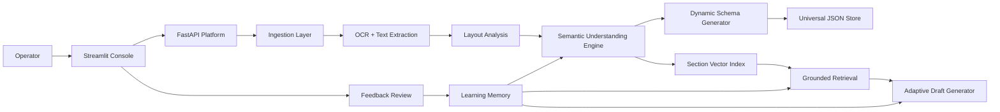
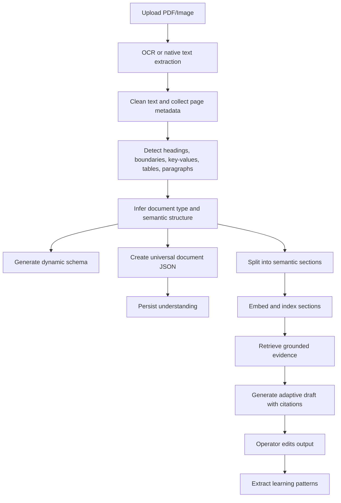
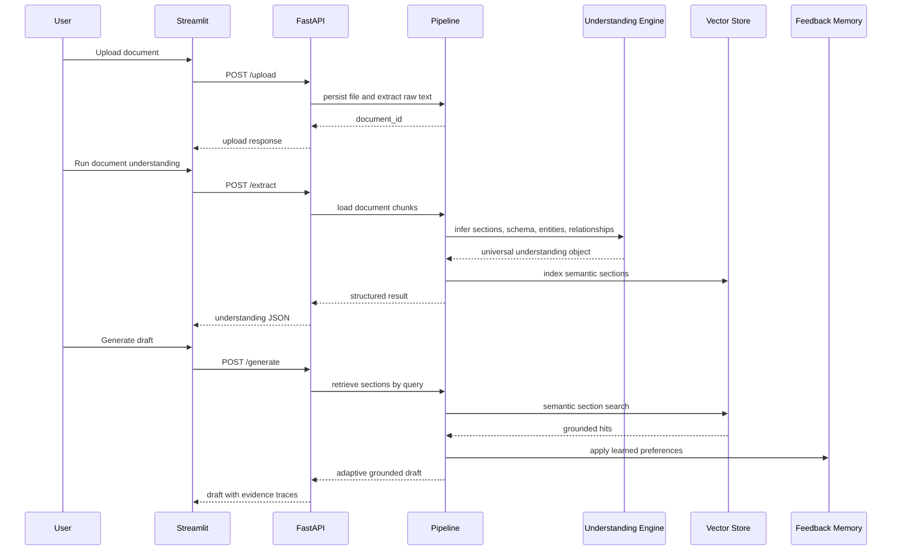
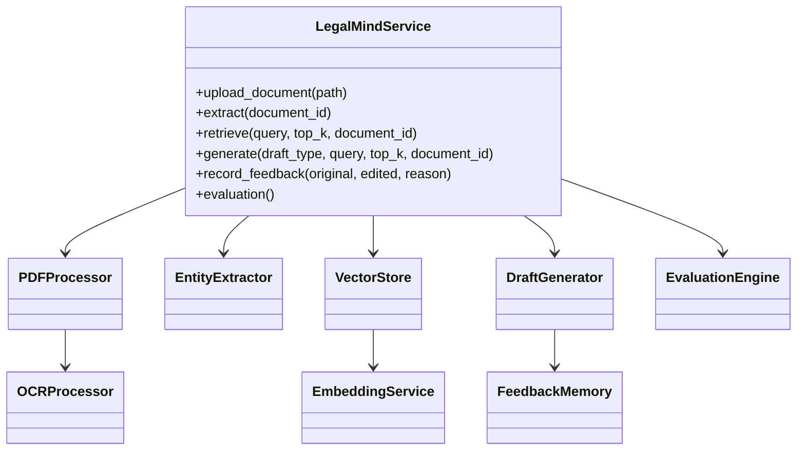

# Architecture

## System Architecture Diagram

## Data Flow Diagram

## Sequence Diagram

## Component Interaction Diagram

## Design notes

- The understanding engine is schema-free and content-driven.
- Sections are the primary retrieval units.
- Universal JSON separates document understanding from downstream task assumptions.
- Feedback memory is positioned as a reusable adaptation layer across extraction, retrieval, and drafting.
